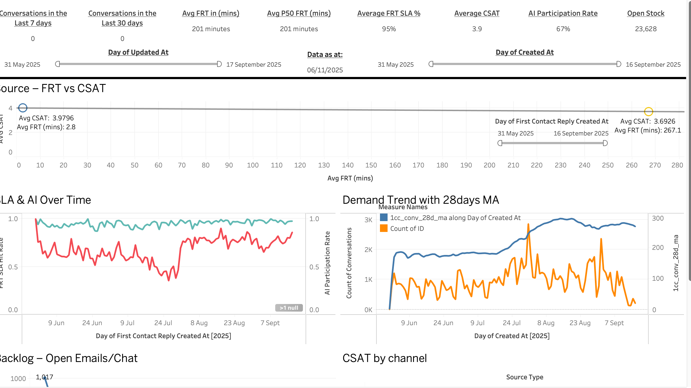
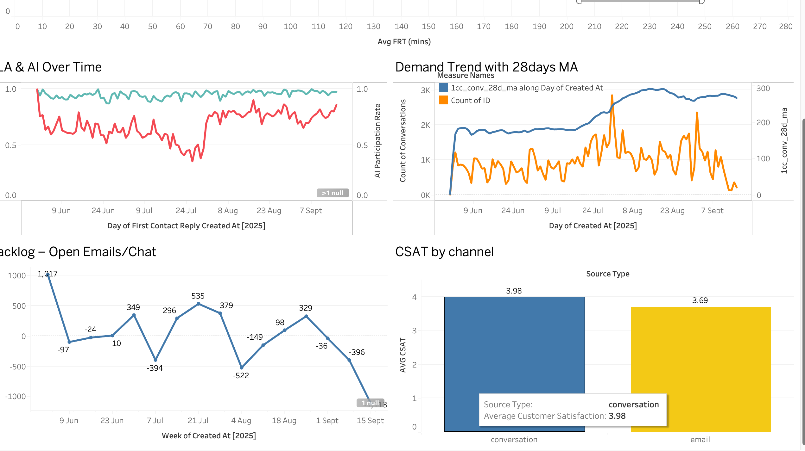

# State of Operations Analysis

## Overview
The dataset represents conversations handled by the Financial Support team in Intercom. Each record is one conversation.
This analysis here assesses operational performance looking into demand, responsiveness, satisfaction and automation. With this information operations can make more informed decisions based on what the data says.

## My Approach - Engineering

Built a dbt pipeline in DuckDB:
- Created a `venv` and `pip install` all necessary packages for this project and used the `requirements.txt` for future development by other engineers.
-----
- Staging models to cast and clean raw Intercom data.
    - Staging model acts as the single source of truth for all subsequent downstream models. Transformation such as casting datatype and maintaining consistent naming patterns. e.g. all timestamps end with` *_at`
------
- Intermediate models (`int_intercom__daily_base`, `int_intercom__ai_v_human_metrics`, etc.) to structure metrics.
    - Intermediate models is where I started deriving the KPIs that will be used in the analytics layer
------
- Final mart (`mart_intercom__operations_performance`) for Tableau consumption, this is full of analytical insights derived from the `ints` models.
    - Ensured data quality through `dbt data tests` not_null and unique tests (though I removed these tests, I would have used custom tests).

## Analytics & Transformation

### Key derived metrics:

`Conversations`: distinct conversation IDs

`Avg / P50 First Response Time (mins)`: average and median time to first reply (P50 = 50th Percentile)   

`FRT SLA Hit Rate`: % of responses within 1 hour (FRT = First Response Time)     

`Avg CSAT`: mean customer satisfaction (1–5 scale and CSAT = Customer Satisfaction)  

`Open Stock`: daily backlog of open conversations (stock = emails or chat)   

`AI Participation Rate`: % of conversations where AI assisted    

`28-Day Moving Average`: smoothed demand to detect seasonality   

## Dashboard Highlights Tableau

- KPI Overview: top headline metrics (volume, SLA, CSAT, AI rate, backlog).

- Demand Trend & 28d Moving Average with clear view of peaks, dips, and monthly seasonality.

- Service Performance with trend of average & P50 first response times and SLA compliance.

- Customer Satisfaction: CSAT by source type, identifying weaker channels.

- AI vs Human Comparison, automation’s effect on responsiveness.

- Backlog Tracking – open conversations over time to measure workload balance.

## Key Insights
- Weekly seasonality: clear midweek peaks (Tue–Thu) and weekend dips.

- Response performance: median (P50) first reply ≈ 15 min, 85% within 1 hour SLA.

- Customer satisfaction: stable overall (avg CSAT ~4.3) but lower on email channel.

- AI involvement: improving SLA hit rate by ~10% in assisted interactions.

- Backlog: increased near end-of-month periods, aligning with repayment cycles.

## Recommendations
- Reallocate staffing to peak weekday hours (10–4pm) for efficiency.

- Expand AI assisted handling to email support to boost SLA adherence.

- Periodic QA review for low CSAT sources to identify friction points.

- Monitor backlog spikes monthly to align workforce planning with demand cycles.

## Tech Stack
| Layer               | Tools                                                    |
| ------------------- | -------------------------------------------------------- |
| Data Transformation | dbt (DuckDB adapter), SQL, Jinja, Python                 |
| Data Modelling      | Star schema (mart + int + staging)                       |
| Data Validation     | dbt tests (not_null, unique, accepted_values)            |
| Visualisation       | Tableau                                                  |
| Environment         | VSCode Codespaces (Python venv, dbt)                     |
| Version Control     | Git CLI, GitHub                                          |